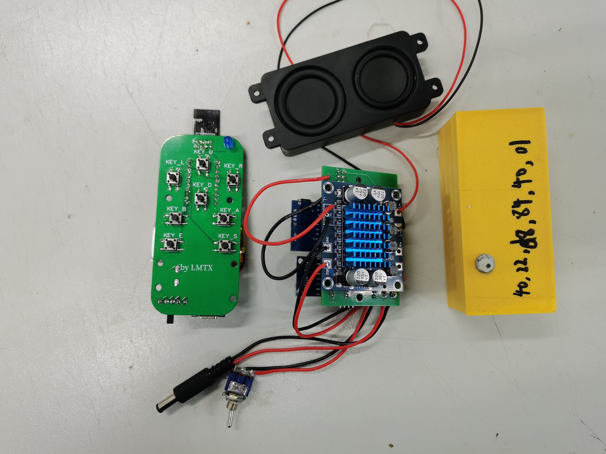
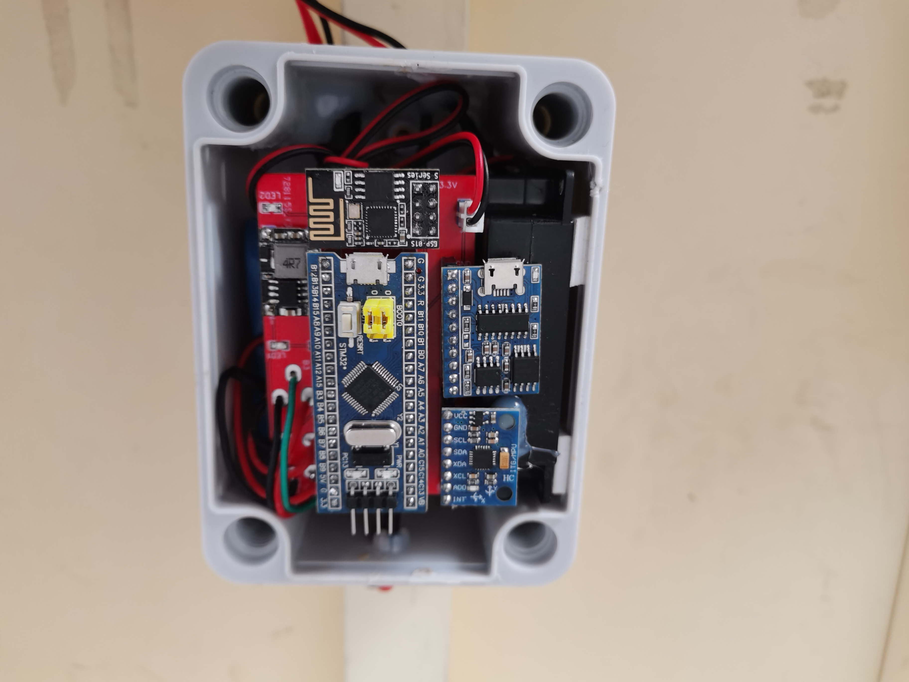
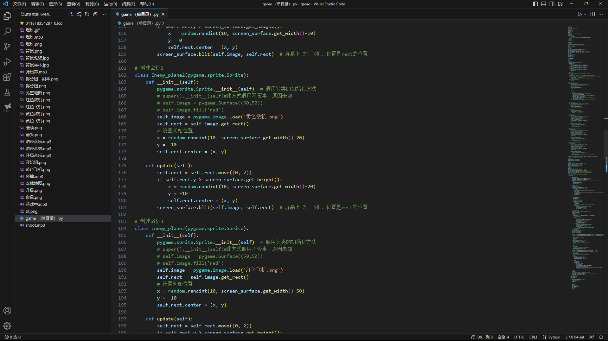

# balance-board

#### 介绍
平衡板项目是基于Bobath疗法的康复训练系统的一个子项目，目的在于将原有康复训练平衡板加装电子传感器，将动作信息转化为声光电并控制游戏角色移动，以吸引患儿主动参与到康复训练中。

项目主要采用ESP-NOW传输协议，实现从机、主机、遥控间的无线数据传输，通过USB与PC端通信

#### 主要器件
STM32F103C8T6 mpu6050 esp-01s 语音模块 功放 喇叭 

#### 实现方法
从机端：
1.  单片机定时获取陀螺仪姿态信息并处理，角度信息通过esp01s运用ESP-NOW协议实时传输到主机
2.  若角度变化超过预定范围则触发语音提醒（语音模式有提示音，游戏模式无提示音）
3.  电量显示

主机端：
1.  通过esp01s实时获取角度信息，通过USB向PC机发送控制信息，从而控制游戏角色移动
2.  实时接收遥控信息，向从机发送切换工作模式信息（语音模式  or  游戏模式）

PC端：
1.  接收USB数据，控制游戏角色移动

